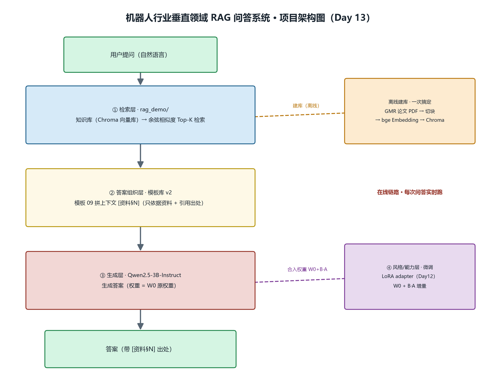

# 机器人行业垂直领域 RAG 问答系统（MVP）

> 一句话介绍：上传机器人行业 PDF（如 GMR 论文）自动建库，问答时先检索资料片段、再由 **QLoRA 微调过的 Qwen2.5-3B** 组织带出处回答；支持**一键切换"原模型 / 微调模型"**，并用 20 条评测题量化检索 / 生成 / 防幻觉三项指标。
> 位置说明：本 MVP 各组件分散在仓库的 `第二周/day*`、`第三周/day*` 按天整理（见下文"目录结构"），本目录（`第三周/day15/`）是整合入口：`config.json` + `ask.py` = 可一键切换的问答端。

---

## 一、系统架构



四层解耦（详见 `../day13/day13-项目主线开发一项目定性与架构定型详细教程.md`）：

| 层 | 组件 | 负责什么 |
|---|---|---|
| 检索层 | Chroma + bge-small-zh 余弦相似度 Top-K（`../day13/build_index.py` 建库） | 从知识库找到相关段落（"答对"的前提） |
| 答案组织层 | 提示词模板库 v2 · 模板 09（资料带段落编号 + 强制出处 + 防幻觉约束） | 把资料拼成"只依据资料 + 带出处"的提示词 |
| 风格/能力层 | QLoRA LoRA adapter（300 条机器人行业 SFT 数据，只训 0.48% 参数，`../day12/lora_adapter/`） | 让回答贴近行业专家口吻（"答得像"） |
| 生成层 | Qwen2.5-3B-Instruct 4bit（显存约 1.9GB，`/v1/chat/completions` OpenAI 兼容接口） | 把提示词变成通顺答案 |

**数据流**：用户提问 → 检索层向量化 + Top-K 取段落 → 模板 09 拼上下文 → Qwen（挂 adapter，`W0 + B·A`）生成 → 带 `[资料§N]` 出处的答案。

---

## 二、运行步骤

> 环境：Windows + NVIDIA 3060（6GB 显存），conda 环境 `llm`（含 transformers / peft / langchain-chroma / langchain-huggingface / fastapi / requests）。

### 1. 建库（一次）

```bash
cd 第三周/day13
python build_index.py      # 读 GMR 论文 PDF → 切块 → bge 向量化 → 存 chroma_db（约 105 chunk）
```

### 2. 起服务（按想测的链路二选一，6G 同一时刻只能跑一个 3B）

```bash
# 原模型链路
cd 第二周/day9
python -m uvicorn local_api:app --host 127.0.0.1 --port 8000

# 微调模型链路（默认）
cd 第三周/day13
python -m uvicorn local_api_lora:app --host 127.0.0.1 --port 8000
```

看到启动日志 `[OK] 模型已就绪：Qwen2.5-3B-Instruct(-LoRA)` 才算就绪。

### 3. 问答（一键切换）

```bash
cd 第三周/day15
python ask.py                          # 默认 profile=lora（微调模型）
python ask.py --profile original       # 一键切到原模型
python ask.py "GMR 的英文全称是什么？"  # 自定义问题
```

**验证**：ask.py 会先查 `/v1/models` 确认服务端模型与 `--profile` 一致（防"服务在跑但跑错模型"）。

---

## 三、效果评估（20 条评测题 · 首版基线 + 第四周优化后）

> 完整逐题判定见 `../day14/首版评测表.md`，逐题明细（含答案原文）见 `../day14/eval_results.json`；评测口径与局限性见 `效果评估报告.md`。
> 评测配置：Qwen2.5-3B-Instruct-LoRA ｜ TOP_K=4 ｜ temperature=0.2 ｜ 模板 09 ｜ 20 题 = 资料内 10 + 资料外 10。

| 指标 | 数值 | 含义 |
|---|---|---|
| 检索层命中率 | 2/10 = 20% | 该召回的答案段落是否被 Top-K 召回（只考资料内 10 题） |
| 生成层正确率 | 2/10 = 20% | 资料内有答案的题，期望关键词是否命中答案 |
| 防幻觉正确率 | 6/10 = 60% | 资料外的题，是否如实答「资料中没有提到」 |
| 总正确率 | 8/20 = 40% | 宏观平均 |
| 防幻觉 F1 | 0.667（P=0.75 / R=0.60） | 把"该不该拒答"当二分类的调和平均 |

**优化后（第四周 Day20 定稿 · 同一套 20 题、`k=8`、`runs=3` 多数投票）**：

| 指标 | 数值 | 相对首版 |
|---|---|---|
| 检索层命中率 | **4/10 = 40%** | 20% → 40%（+2 题）｜唯一稳定有效的一步：**TOP_K 4→8** |
| 生成层正确率 | **4/10 = 40%** | 20% → 40%；再加「引文强制白名单」兜底为 **5/10 = 50%** |
| 防幻觉正确率 | **7/10 = 70%** | 60% → 70% |
| 总正确率 | **11/20 = 55%** | 40% → 55%；带兜底 **12/20 = 60%** |
| 防幻觉 F1 | **0.824**（TP=7 / FP=0 / FN=3 / TN=10） | 0.667 → 0.824（**FP 归零**） |
| 一致率 | 0.950 | 同题 3 次判定的多数占比（**≥0.93 才对外引用**） |

> ⚠ **口径声明（不许混着减）**：**优化后**那张表是 **`runs=3` + 双轨检索判据 + 判据校准**；**首版基线**表是 **`runs=1` + 旧判据**。
> 两个口径**不能严格相减**——要最严谨就用**同口径**的 `B0r3 → R3`（总正确率 40% → 55%）；
> 「首版 40% → 优化后 55%」是**面向汇报/简历的一句话口径**，引用时必须同时说明口径。
> 数字**唯一来源**：`第四周\day20\定稿数字表.md`（由脚本从各结果目录 `run_log.txt` 机器抄录 + 自动校验 F1↔混淆矩阵自洽）。
> 完整优化过程、逐步骤贡献与失败尝试见 `第四周\day20\优化成果报告.md`。

**结论一句话**（第四周 Day20 更新）：链路可演示、评估可量化；**首版主瓶颈（检索召回）已按 P1 目标解决**——检索命中率 20% → **40%**、防幻觉 F1 0.667 → **0.824**。
> 其余三类改动（bge instruction 前缀、查询改写三档、模板 v2 系）**实测均无净增益**，已作为**可复现的负结果**记录（有机制解释），未被"删掉好看"。

---

## 四、目录结构（本仓库实际布局）

```
大模型算法/
├─ 第二周/
│  ├─ day9/local_api.py                 # 原模型 OpenAI 兼容服务（Qwen2.5-3B-Instruct）
│  └─ day10/rag_demo/                   # RAG demo 初版：build_index.py / ask.py（本 MVP 检索逻辑来源）
├─ 第三周/
│  ├─ day11/                            # SFT 数据：make_sft_data.py + sft_data.json（300 条）
│  ├─ day12/                            # QLoRA 微调：train_lora.py + lora_adapter/（权重不进 git）+ 对比表
│  ├─ day13/                            # 项目定型：build_index.py、eval_questions.json（20 题）、
│  │                                    #   local_api_lora.py（微调服务）、项目架构图.png、chroma_db/（不进 git）
│  ├─ day14/                            # 量化评测：eval.py + 首版评测表.md + eval_results.json
│  └─ day15/                            # ★ 本项目 MVP 整合入口（本目录）
│     ├─ config.json                    #   一键切换配置（original / lora 两个 profile）
│     ├─ ask.py                         #   配置化问答端（检索 + 模板 09 + 生成）
│     ├─ README.md                      #   本文件
│     ├─ 效果评估报告.md                 #   正式评估报告（投简历/面试用）
│     ├─ 面试四问.md                     #   项目四问 Q1~Q4 话术
│     ├─ 双链路冒烟测试记录.md           #   两条链路冒烟验证记录
│     ├─ 冒烟日志_lora.txt / _original.txt # 双链路实测日志（样例问答素材）
│     ├─ 项目架构图.png                  #   架构图（从 day13 复制，README 引用）
│     └─ day15-项目完结MVP整合与效果评估报告详细教程.md  # 当日教程
└─ download/                            # 本地模型（Qwen2.5-3B-Instruct、bge-small-zh-v1.5），不进 git
```

---

## 五、技术栈与关键数字（简历速查）

- Python / PyTorch / HuggingFace Transformers / PEFT / LangChain / Chroma / FastAPI / Qwen2.5-3B / bge-small-zh
- QLoRA 微调：4bit（NF4）底座 + LoRA r=8 alpha=16，训练参数 14,966,784 / 总 3.10B = **0.4827%**，adapter 约 20~30MB
- 显存账：4bit 底座约 1.92GB（微调服务实测约 1.98GB），6G 显卡本地跑通全链路
- 数据账：300 条机器人行业三字段（instruction/input/output）SFT 数据，0 重复；**第四周进一步整改为 201 条可追溯真实数据**（论文 90 条逐字回查 + 行业 111 条带 URL/原文摘录）
- 评测账（**首版基线**）：20 条题（资料内 10 + 资料外 10）→ 检索 20% / 生成 20% / 防幻觉 60% / 总 40% / 防幻觉 F1=0.667
- 评测账（**第四周 Day20 优化后**，同 20 题、`k=8`、`runs=3`）→ 检索 **40%** / 生成 **40%**（带引文兜底 50%）/ 防幻觉 **70%** / 总 **55%**（带兜底 60%）/ 防幻觉 F1 **0.824**（TP=7 FP=0 FN=3 TN=10）、一致率 0.950
