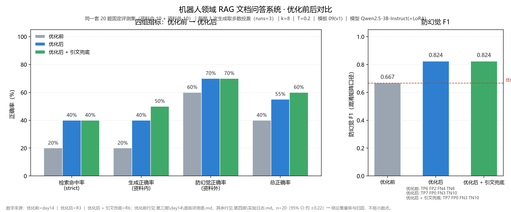

# 机器人领域 RAG 文档问答系统：从"跑通流程"到"可用的优化成果"

> 一句话：上传领域 PDF 自动建库，问答先检索资料片段、再由 QLoRA 微调过的 Qwen2.5-3B 组织**带出处**的回答；针对基线检索命中率低的问题做了一组可归因的优化实验，把检索命中率从 **20%** 提升到 **40%**，防幻觉 F1 从 **0.667** 提升到 **0.824**。

> 本文写作纪律：所有数字来自**同一套 20 题固定评测集 + 多跑取多数**，每一步单独重跑、可复现；数字唯一来源是项目内的《定稿数字表》（由脚本从实验日志机器抄录并自动校验 F1↔混淆矩阵自洽），**跑出来是多少就写多少**，**跑出来不如预期的（含"原模型优于微调"）也照原样写进去**。

---

## 一、为什么要做这个项目

机器人行业的资料（论文、公告、技术文档）多且专，通用大模型**不知道私有资料、回答容易过时和编造**。我用两条互补路线解决：

- **RAG 管"事实"**：检索到正确资料，才能答对；
- **QLoRA 微调管"风格"**：让回答像行业专家，简洁、专业、有行话。

## 二、系统架构（四层解耦）

| 层 | 组件 | 负责什么 |
|---|---|---|
| 检索层 | bge-small-zh 向量化 + Chroma 余弦 Top-K | 从知识库找出相关段落（"答对"的前提） |
| 答案组织层 | 提示词模板（只依据资料 + 强制出处 + 防幻觉约束） | 拼"只依据资料"的提示词 |
| 风格/能力层 | QLoRA LoRA adapter（只训 0.48% 参数） | 让回答贴近行业专家口吻 |
| 生成层 | Qwen2.5-3B-Instruct 4bit（6GB 显存可跑） | 把提示词变成通顺答案 |

**数据流**：提问 → 向量化 + Top-K 检索 → 模板拼上下文 → Qwen（挂 adapter）生成 → 带 `[资料§N]` 出处的答案。

## 三、优化前后对比（本文核心）

基线评测在 **同一套 20 题**（资料内 10 + 资料外 10）上跑出：检索命中率 **20%**、生成正确率 **20%**、防幻觉 **60%**、防幻觉 F1 **0.667**。检索是瓶颈——10 道资料内有 8 道连答案段落都没被召回。

**优化步骤与贡献**（每步只改一个变量、单独重跑）：

| 步骤 | 改动 | 检索命中率 | 说明 |
|---|---|---|---|
| 基线 | TOP_K=4，无查询前缀 | 20% | —— |
| 步骤 1 | 加 bge 查询侧 instruction 前缀 | **0%** | **负结果**：不是语义变差，而是**排名位移**（答案段从第 4 名掉到第 5 名，k=4 时被挤出窗口） |
| 步骤 2 | TOP_K 4 → 8 | **40%** | ⭐ 本项目**唯一稳定有效**的一步：期望段从"第 5 名"回到窗口内 |
| 步骤 3 | 查询改写（术语档 / HyDE / 两档合并）＋ 模板逐句消融 ＋ BM25+RRF 混合检索 | **40%**（不变） | **三档改写均无净增益**（伤专名／伤拒答）；模板 v2 系三档全线回退；RRF 因中文 BM25 近零信号而有害。**结论：加大 k 之后，瓶颈已不在"怎么改写查询"** |
| 步骤 4 | 交付层：**引文强制白名单**（非法编号就地剪除） | **40%**（不变） | ⭐ **唯一零副作用**的工程兜底：交付口径非法引用 **5 → 0 处**，F1 逐格不变、判定与拒答**零翻转** |
| 步骤 5 | **原模型 vs 微调模型**（同库同参，只换 adapter） | **40%**（两轮逐位相同） | ⭐ **逆预期的负结果，照实写**：**原模型防幻觉 F1 0.947 / 总正确率 80%**，**全面高于微调版 0.824 / 55%**；**这版微调在防幻觉上是负收益**（边界见下） |
| 步骤 6 | **拆变量**：真实 201 + 合成 99 = 300 重训 | **40%**（两轮逐位相同） | 把"数据来源"与"数据数量"拆开后，F1 仍只有 **0.429** ⇒ **退化的主因是"数据分布与评测集不匹配"，不是样本数量** |
| **优化后** | —— | **40%** | 生成正确率 **40%**、防幻觉 F1 **0.824**、总正确率 **55%**；带上第 4 步兜底后生成 **50%**、总正确率 **60%** |

**失败尝试（如实记录）**：五类改动**全部没用或反而更差**，且每一类都能给出机制——
① **bge instruction 前缀**：检索命中率 20% → **0%**（排名位移，不是语义变差）；
② **模板 v2 系（逐句消融）**：防幻觉 7/10 → **3 / 4 / 6**、F1 0.824 → **0.462 / 0.571 / 0.706**，**归因锁死在一句提示语**（"资料里有依据就照实回答"）——资料外题检索到的 8 条里总"看着像依据"，模型就答了，**"误读型幻觉"提示词治不了**；
③ **引文兜底 `retry`（点名后重答一次）**：F1 0.824 → **0.737**（FP 0→2）——给 3B 任何"允许拒答"的措辞，它就把出口当答案（甚至交出空答案）；
④ **真实数据微调（v2）**：F1 0.824 → **0.333**（防幻觉 7/10 → 2/10），**这是负结果而非"数据无用"**（见第四节）；补跑"数量对齐"版（真实 201 + 合成 99 = 300）后 F1 仍只有 **0.429** ⇒ **主因是数据分布与评测集不匹配，不是样本少**；
⑤ ⭐ **原模型 vs 微调模型（同库同参、只换 adapter）**：**原模型 F1 0.947、总正确率 80%，全面高于微调 0.824 / 55%**（两轮检索结果**逐位相同**，差异纯在生成层）——**我原本想用它证明"微调有用"，结果是反过来的，我照实写。**

> 这一节和上面的"提升"同等重要：**能说清"我试了什么、为什么没用"，才是可归因的优化，而不是碰运气涨分。**

## 四、数据：为什么用真实数据做微调

领域微调的效果取决于数据真不真。SFT 数据 v2 全部**可追溯来源**：

- 从 GMR 论文人工提取真实问答 **90 条**（术语 / 方法 / 实验 / 结论，`source` 标注到页码 chunk，**逐字回查 90/90**、泄漏 0）；
- 采集公开真实机器人行业资料构造问答 **111 条**（公司公告 / 官网 / 国家标准 / 权威媒体，每条带 URL 与原文摘录，覆盖 **26 个机构**、最大机构占比 10.8%、泄漏 0、重复 0）；
- 保留此前的合成数据作对照，做"**真实 vs 合成**"微调对比实验：**201 条真实数据 vs 300 条合成数据，同配置下防幻觉 7/10 → 2/10、F1 0.824 → 0.333**——**这是负结果，但两个变量同时变了（来源 + 数量）**，所以我又补跑了"**真实 201 + 合成 99 = 300**"的配比版把"数量"对齐：**F1 仍只有 0.429（防幻觉 3/10，只比 v2 回了 1 题）** ⇒ **"数量少了 99 条"解释不了这个差距，主因是"这批真实数据的分布（55% 是行业语料）与评测集（出自论文）不匹配"**。
- ⭐ 另外用**同一把尺子**量了"**原模型 vs 微调模型**"：**原模型 F1 0.947、总正确率 80%**，**高于微调版 0.824 / 55%**（检索结果两轮逐位相同，差异纯在生成层）⇒ **这版微调在防幻觉上是负收益**。**我不把这条藏起来**——它恰好印证了分工：**知识来自检索，微调改的是说话方式**（收益体现在风格 / 术语 / 格式遵循，不是本评测集的判据）。

> ⚠ **一条诚实标注**：行业资料**不在知识库内**，因此**无法逐字回查**（论文那 90 条可以）——这一点在报告里写明了，没有假装能回查。另外采集时遇到同一家公司**年报口径乐观、监管问询口径谨慎**的情况，**两条都收**，不做"挑好看的"。

## 五、在线 Demo 与代码

- **在线 Demo（魔搭创空间 / ModelScope Studio）**：[https://modelscope.cn/studios/LanMercer/rag233](https://modelscope.cn/studios/LanMercer/rag233)（直达域名 `https://lanmercer-rag233.ms.show`）
  — ⭐ **点开就能试：不上传任何文件，直接用内置示例语料（GMR 论文 105 段）提问**，返回带 `[资料§N]` 出处的答案；
  也可上传自己的 PDF 建库（会**覆盖**内置语料）。
  > 🔍 **一个可以自己验的细节**：内置语料用的就是本项目**离线评测的同一批切块**，
  > 所以页面上显示的 `[资料§N]` 编号与离线评测表**一一对应**——线上和离线是同一个检索口径。
  > **⚠️ 诚实标注**：该 Demo 的**检索层为项目真实实现**（bge + Chroma + Top-K + 模板 09），
  > 但**生成层使用 DeepSeek API（`deepseek-chat`），并非本项目的微调模型**——免费 CPU 跑不动 3B，仅以 DeepSeek 代生成省算力。
  > 本地版本为 QLoRA 微调的 Qwen2.5-3B-Instruct；**本文所有评测数字均来自本地 Qwen 版本，不代表该 Demo 的 DeepSeek 结果**。
  > 微调效果见第三节与演示 GIF。
- **代码仓库**：[https://github.com/LanMercer/rag233](https://github.com/LanMercer/rag233)（已完成 Day20 定稿；模型权重/LoRA adapter/向量库不入库）
- **本地运行**：见仓库根目录 `README.md` 的「快速开始」（上传 PDF 建库 → 起本地模型服务 → 提问；**也可直接用内置示例语料跳过建库**）。最快的一条命令：在 `第四周\day17` 下 `python start.py --check` 先做环境自检，`--start-service` 则会自动起服务并拉起界面

## 六、局限与下一步

- 评测集 n=20，置信区间较宽，结论看量级与归因、不抠小数点；
- 在线 Demo 的**生成层为 DeepSeek API，非本地微调模型**（检索层为真实实现）——这是算力取舍，故本文评测数字与在线 Demo 不构成同一模型的对比；
- 下一步：① **Rerank 与混合检索上真实现**——改写后做"向量 + BM25 融合"已能把命中拉起来（但那是**评估侧实验，尚未接回生产链路**），下一步把它接回；② **把"误读型幻觉"交给更大模型或数据**（提示词已证明治不了）；③ **评测扩到 n≥60** 收窄置信区间（n=20 的 95% CI 约 ±0.22，现在只能谈量级与归因）。

---

> 附：完整优化报告、逐步骤实验日志与复现命令见代码仓库 `第四周\` 目录。
